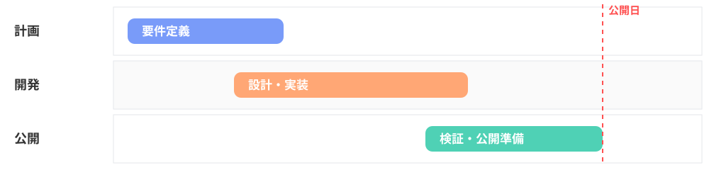

<!-- _class: title -->
<!-- _paginate: false -->

# RS **Marp** テンプレート

きれいなスライドを、Markdown だけで再現性高く

<i class="fa-regular fa-calendar"></i> 2026.06.22

---

<!-- _class: section -->
<!-- _paginate: false -->

# 書き方

---

## <i class="fa-solid fa-pen-nib"></i> 基本

- 見出しは `## <i ...></i> タイトル` — 左上にアイコン付き
- 箇条書きは ・（中黒）で表示
- `**強調**` → プライマリ、`*強調*` 内の `**二重**` → アクセント
- 引用 `>` は左にアクセントのライン

> シンプルなルールだけ覚えれば、あとは書くだけ。

---

## <i class="fa-solid fa-table"></i> テーブル

| 項目 | 内容 |
|---|---|
| ヘッダー | 薄い背景＋太字 |
| 偶数行 | ごく薄い背景 |
| 文字サイズ | 自動で収まるよう調整 |

補足は <code>note</code> で。左にアクセントのラインが付く。本文の言い換えにすぎないなら置かない。

---

## <i class="fa-solid fa-diagram-project"></i> 外部 SVG を読み込む

図版は <code>assets/</code> に置き、<code>&lt;img src="assets/*.svg"&gt;</code> で読み込む。スタイルは SVG 内に閉じ込め、テンプレの <code>style.css</code> は汚さない。

---

## <i class="fa-solid fa-palette"></i> 色

- <i class="fa-solid fa-circle" style="color:var(--color-primary)"></i> **Primary** `#799BF9` — 見出し・強調・リンク
- <i class="fa-solid fa-circle" style="color:var(--color-accent)"></i> **Accent** `#FFA775` — 箇条書き・引用線
- <i class="fa-solid fa-circle" style="color:var(--color-danger)"></i> **Danger** `#FF5151` — 注意喚起

> 色は最小限に。多すぎると散漫になります。

---

<!-- _class: title -->
<!-- _paginate: false -->

# Write **Less**, Show More

余計なものを削ぎ落とし、伝えたいことだけを
